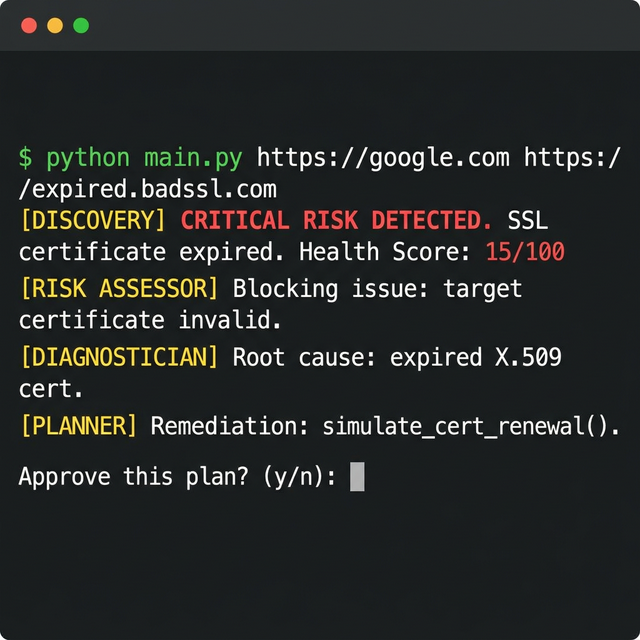
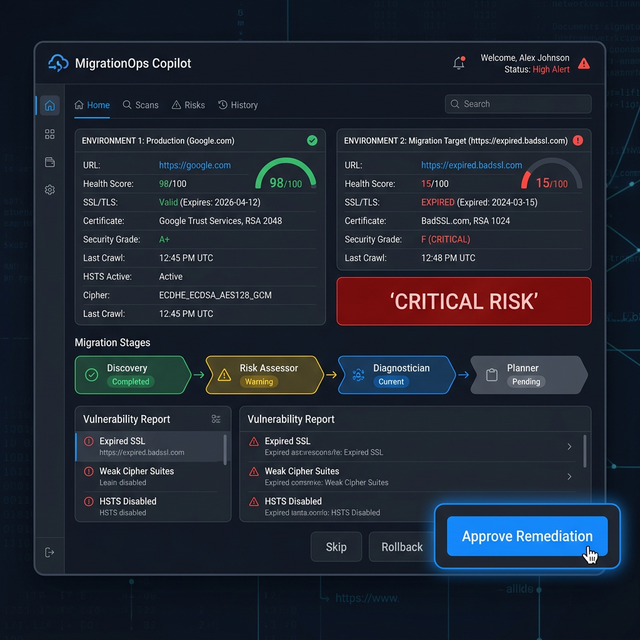
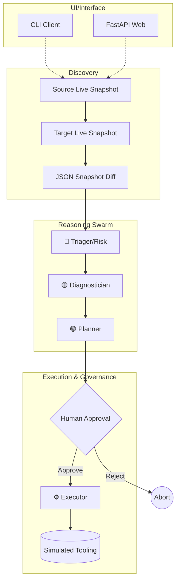

# 🚀 MigrationOps Copilot

<div align="center">
  
</div>

[](https://aka.ms/aidevdayshackathon)
[]()
[]()
[](https://github.com/shahaman098/MigrationOps-Copilot/actions/workflows/ci.yml)

**The AI-powered, multi-agent safeguard for website migrations.**

> 🎥 **[Watch the 2-minute demo →](REPLACE_WITH_YOUTUBE_URL)**

## 📸 Screenshots

### CLI — Broken Migration Detection


### Web UI — Migration Analysis Dashboard  


---

## ⚡ Quick Snapshot

| Category | Details |
| :--- | :--- |
| **Purpose** | Validate website migrations to prevent SSL, DNS, and HTTP breakage. |
| **Users** | SREs, DevOps Engineers, Cloud Migration Teams. |
| **Core Capability** | Multi-agent snapshot comparison and remediation simulation. |
| **Stack** | Python 3.10+, Microsoft Agent Framework, Azure OpenAI, FastAPI. |
| **Architecture Pattern**| Sequential deterministic pipeline with human-in-the-loop governance. |
| **Status** | Production-grade reasoning prototype; safe-simulated execution. |
| **Deployment Style** | Local CLI / Azure App Service / Local Docker / MCP-compatible. |
| **Notable Feature** | Strict separation of real discovery and simulated mutation logic. |

---

## 🧠 Why this exists

Website migrations are one of the easiest ways to ship a hidden outage, where SSL certificates expire on new load balancers, DNS targets change but propagate unevenly, or critical paths return 404s after cutover. Small teams traditionally validate these changes with manual *curl* checks or ad-hoc browser testing, meaning subtle breakage reaches users first. MigrationOps Copilot fixes this by replacing fragile manual testing with a deterministic, AI-driven audit trail that validates exact environment state changes *before* traffic shifts fully.

---

## ⚙️ What it does

MigrationOps Copilot captures live state across two environments (Source and Target), diffs the results, and orchestrates a pipeline of Azure OpenAI agents:
1. Flags exact regressions in SSL trust, DNS resolution, and HTTP health.
2. Assigns a migration risk category.
3. Performs root-cause diagnostics on the breakage.
4. Drafts a precise remediation plan.
5. Blocks on a human approval gate.
6. Formally "executes" the remediation plan against secure, simulated endpoints.

---

## 🏗️ Microsoft Technologies Used

| Technology | How It's Used | Status |
|:---|:---|:---|
| **Microsoft Agent Framework** | All reasoning agents (Risk Assessor, Diagnostician, Planner, Executor) built with `AzureOpenAIResponsesClient` and `@tool` decorator | ✅ Implemented |
| **Azure OpenAI (via Foundry)** | LLM backend powering all agent reasoning and decision-making | ✅ Implemented |
| **Model Context Protocol (MCP)** | Custom MCP server exposing health check tools; agents discover and call tools via MCP protocol | ✅ Implemented |
| **Azure App Service** | Deployment target with Procfile, startup script, and full deployment documentation | ✅ Documented |
| **GitHub Actions** | CI pipeline running automated tool and baseline tests on every push | ✅ Implemented |
| **GitHub Copilot** | Used during development to accelerate implementation | ✅ Used |

---

## 🏛️ System Architecture

MigrationOps Copilot forces migrations through a rigorous, human-in-the-loop governance timeline—where discovery is live, reasoning is autonomous, and execution is strictly gated. 

*(For deep implementation details, state flow mapping, and limitations, see [docs/architecture.md](docs/architecture.md))*



---

## 🤖 Agent Details

| Agent | Role | Input | Output | Tools |
|-------|------|-------|--------|-------|
| Discovery | Capture source and target state | Source URL, Target URL | Two live snapshots and a comparison report | `check_ssl_certificate`, `check_http_status`, `check_dns_resolution` |
| Risk Assessor | Classify migration risk | Comparison report | Risk level, blocking issues, recommendation | None |
| Diagnostician | Explain root causes | Risk assessment | Root cause analysis per issue | None |
| Planner | Build remediation plan | Diagnostics report | Prioritized remediation plan | None |
| Executor | Simulate approved fixes | Approved plan and migration context | Execution log and final verification status | `simulate_cert_renewal`, `simulate_cache_purge`, `simulate_config_update` |

---

## 🔬 Real vs. Simulated

| Component | Status | Detail |
|:---|:---|:---|
| SSL certificate check | ✅ **REAL** | Actual TLS handshake via Python `ssl` + `socket` |
| HTTP status check | ✅ **REAL** | Actual HTTP request via `httpx` |
| DNS resolution | ✅ **REAL** | Actual DNS lookup via `socket.getaddrinfo` |
| Snapshot comparison | ✅ **REAL** | Deterministic JSON diff with health scoring |
| Agent reasoning | ✅ **REAL** | Live Azure OpenAI calls via Agent Framework |
| Human approval gate | ✅ **REAL** | CLI `input()` and Web UI approve/reject buttons |
| Certificate renewal | ⚠️ **SIMULATED** | Logged with `"simulated": true`, never executed |
| Cache purge | ⚠️ **SIMULATED** | Logged with `"simulated": true`, never executed |
| Config update | ⚠️ **SIMULATED** | Logged with `"simulated": true`, never executed |

> Remediation is intentionally simulated for safety. In production, these connect to real infrastructure APIs.

---

## ✅ Verified Scenarios

| Source | Target | Risk Level | Health Score | Recommendation |
|:---|:---|:---|:---|:---|
| `google.com` | `expired.badssl.com` | 🔴 CRITICAL | 15/100 | BLOCK MIGRATION |
| `google.com` | `google.com` | 🟢 LOW | 100/100 | PROCEED |

All scenarios verified via automated tests and manual CLI/Web UI/MCP testing.

---

## 💻 Quick Start

**Prerequisites**
- Python 3.10+
- Azure CLI (`az login`) or `AZURE_OPENAI_API_KEY`

**Setup**
```bash
git clone https://github.com/shahaman098/MigrationOps-Copilot.git
cd MigrationOps-Copilot
python3 -m venv .venv
source .venv/bin/activate
python -m pip install -r requirements.txt --pre
cp .env.example .env
```

**Local CLI Run**
```bash
python main.py https://google.com https://expired.badssl.com
```

**Web Server Run**
```bash
python app.py
# Open http://localhost:8000
```

---

## ⚙️ Configuration

Set via `.env` at the root of the project.

| Variable | Required? | Usage |
| :--- | :--- | :--- |
| `AZURE_OPENAI_ENDPOINT` | **Yes** | Full URL to the Azure OpenAI resource point. |
| `AZURE_OPENAI_RESPONSES_DEPLOYMENT_NAME` | **Yes** | The exact name of your deployed inference model (e.g., `gpt-4o`). |
| `AZURE_OPENAI_API_KEY` | No | Overrides `AzureCliCredential` fallback mechanism. |

---

## 🔌 API / CLI / Interface Surface

### FastAPI Routes
| Route | Method | Payload Example | Action |
| :--- | :--- | :--- | :--- |
| `/api/analyze` | `POST` | `{"source_url": "x", "target_url": "y", "use_mcp": false}` | Generates diagnostic data. |
| `/api/execute` | `POST` | `{"analysis_id": "abc-123", "approved": true}` | Dispatches simulated execution. |

### CLI Interface
| Argument | Description |
| :--- | :--- |
| `<source_url>` | Required. Source origin URI. |
| `<target_url>` | Required. Target validation URI. |
| `--mcp` | Optional. Forces Discovery tools to proxy over the local `mcp_server`. |

---

## 📂 Project Structure

```text
MigrationOps-Copilot/
├── .github/workflows/
│   └── ci.yml
├── agents/
│   ├── __init__.py, diagnostician.py, executor.py, monitor.py, planner.py, triager.py
├── docs/
│   ├── architecture.md
│   ├── azure-deploy.md
│   └── screenshots/
│       ├── cli-broken-migration.png
│       └── web-ui.png
├── mcp_server/
│   ├── __init__.py, server.py, README.md
├── static/
│   └── index.html
├── tests/
│   ├── test_agents.py, test_baseline.py, test_monitor.py, test_pipeline.py, test_tools.py
├── tools/
│   ├── __init__.py, baseline.py, health_checks.py, remediation.py
├── .env.example
├── .gitignore
├── app.py
├── azure_client.py
├── DEMO_SCRIPT.md
├── LICENSE
├── main.py
├── pipeline.py
├── Procfile
├── requirements.txt
├── smoke_test.py
└── startup.sh
```

---

## 🏆 Hackathon Category

**Primary target:** Build AI Applications & Agents using Microsoft AI Platform and tools  
**Secondary target:** Best Multi-Agent System

MigrationOps Copilot demonstrates a production-grade multi-agent pipeline where specialized agents collaborate through sequential handoffs with human-in-the-loop governance to solve the real-world problem of website migration validation. Built entirely on Microsoft Agent Framework and Azure OpenAI.

---
*Built for the Microsoft AI Dev Days Global Hackathon 2026. Engineered to eliminate hidden migration outages.*
