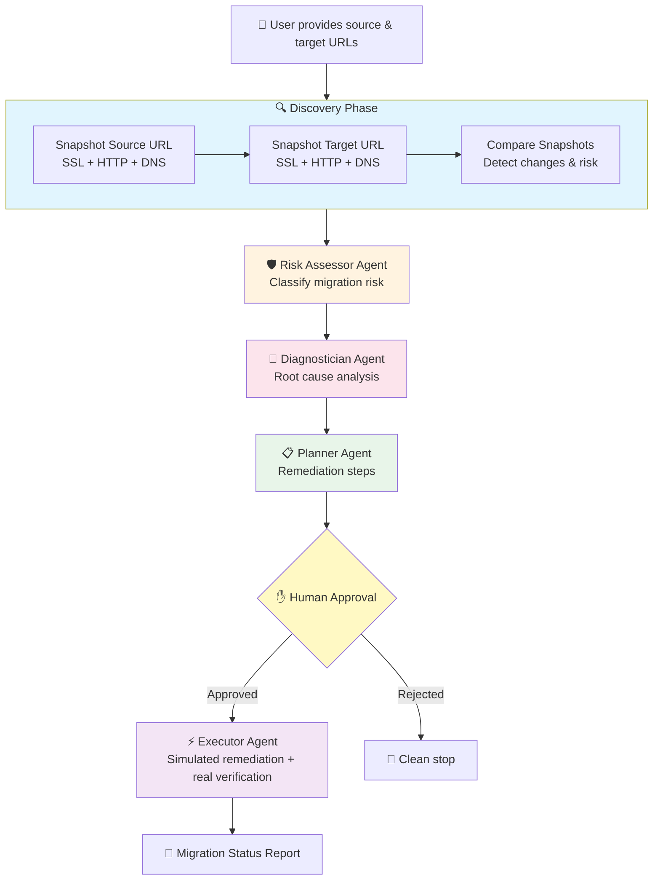

# 🚀 MigrationOps Copilot

**AI-powered multi-agent migration validation for teams moving to Azure**

Built for the [Microsoft AI Dev Days Global Hackathon](https://aka.ms/aidevdayshackathon)

## Problem Statement

Website and cloud migrations are one of the most error-prone operations tasks. SSL certificates break, DNS does not propagate as expected, pages return 404s, and response times degrade. Small teams usually validate migrations manually, miss critical issues, and only discover failures after users are impacted. MigrationOps Copilot acts like an AI operations team that validates a migration before customers find the problems.

## What It Does

MigrationOps Copilot takes a source URL (pre-migration) and a target URL (post-migration), snapshots both using real network checks for SSL, HTTP, and DNS, compares the results to detect what changed or broke, then runs a team of AI agents to assess risk, diagnose root causes, plan remediation, and execute simulated fixes with a human approval gate before any action is taken.

## Architecture Diagram



## Agent Details

| Agent | Role | Input | Output | Tools |
|-------|------|-------|--------|-------|
| Discovery (snapshot) | Capture pre/post migration state | Source URL, Target URL | Two health snapshots + comparison report | check_ssl_certificate, check_http_status, check_dns_resolution (all REAL) |
| Risk Assessor | Classify migration risk | Comparison report | Risk level (CRITICAL/HIGH/MEDIUM/LOW) + blocking issues | None (LLM reasoning) |
| Diagnostician | Identify root causes | Risk assessment | Root cause analysis per issue | None (LLM reasoning) |
| Planner | Propose remediation | Diagnostics report | Prioritized remediation plan | None (LLM reasoning) |
| Executor | Execute fixes | Approved plan | Execution log + status report | simulate_cert_renewal, simulate_cache_purge, simulate_config_update (SIMULATED), check_http_status (REAL verification) |

## Microsoft Technologies Used

| Technology | How It's Used |
|-----------|--------------|
| **Microsoft Agent Framework** | All 5 agents built with Agent Framework RC4, using `AzureOpenAIResponsesClient` and `@tool` decorator |
| **Azure OpenAI (via Foundry)** | LLM backend for all agent reasoning — risk assessment, diagnosis, planning, execution |
| **Azure MCP** | Architecture supports MCP tool server integration (extensibility path) |
| **GitHub Copilot Agent Mode** | Used during development to accelerate implementation |

### 🔬 Real vs. Simulated

| Component | Status |
|-----------|--------|
| SSL certificate check | ✅ **REAL** — actual TLS handshake |
| HTTP status check | ✅ **REAL** — actual HTTP request |
| DNS resolution check | ✅ **REAL** — actual DNS lookup |
| Snapshot comparison | ✅ **REAL** — structured diff of actual data |
| Agent reasoning (all 5) | ✅ **REAL** — Azure OpenAI LLM calls |
| Human approval gate | ✅ **REAL** — CLI prompt |
| Certificate renewal | ⚠️ **SIMULATED** — logged, not executed |
| Cache purge | ⚠️ **SIMULATED** — logged, not executed |
| Config update | ⚠️ **SIMULATED** — logged, not executed |

> Remediation actions are intentionally simulated for safety. In production, these would connect to real infrastructure APIs with appropriate authorization.

### 🚀 Quick Start

**Prerequisites:**
- Python 3.10+
- Azure OpenAI deployment (`gpt-4o-mini` or similar)
- Azure CLI (`az login` configured)

**Setup:**
```bash
git clone https://github.com/<your-username>/migrationops-copilot.git
cd migrationops-copilot
pip install -r requirements.txt --pre
cp .env.example .env
# Edit .env with your Azure OpenAI endpoint and deployment name
```

**Run:**
```bash
python main.py https://source-site.com https://target-site.com
```

**Example (detect broken migration):**
```bash
python main.py https://google.com https://expired.badssl.com
```

**Example (verify clean migration):**
```bash
python main.py https://google.com https://google.com
```

### 🎥 Demo

[Watch the 2-minute demo →](YOUR_YOUTUBE_LINK_HERE)

The demo shows MigrationOps Copilot detecting that a migrated site has:
- An expired SSL certificate (CRITICAL)
- Changed DNS resolution (expected during migration)
- Different response characteristics

The agents assess risk as CRITICAL, diagnose SSL misconfiguration as the root cause, propose remediation steps, and after human approval, simulate the fix and verify the result.

### 📁 Project Structure

```text
migrationops-copilot/
├── main.py                 # CLI entry point
├── pipeline.py             # Multi-agent orchestration
├── agents/
│   ├── monitor.py          # Discovery agent (site snapshots)
│   ├── triager.py          # Risk Assessor agent
│   ├── diagnostician.py    # Root cause analysis agent
│   ├── planner.py          # Remediation planning agent
│   └── executor.py         # Simulated execution agent
├── tools/
│   ├── health_checks.py    # Real SSL/HTTP/DNS check tools
│   ├── remediation.py      # Simulated remediation tools
│   └── baseline.py         # Snapshot & comparison engine
├── tests/                  # Verification scripts
├── requirements.txt        # Python dependencies
└── .env.example            # Environment variable template
```

### 🏆 Hackathon Category

**Primary:** Build AI Applications & Agents using Microsoft AI Platform and tools

**Also applicable:** Best Multi-Agent System — MigrationOps Copilot demonstrates sophisticated multi-agent orchestration where five specialized agents collaborate through a sequential pipeline with human-in-the-loop governance to solve the complex, ambiguous problem of migration validation.

## Why This Matters

Every organization that moves to Azure faces migration risk. MigrationOps Copilot turns the chaotic, manual process of validating a migration into a structured, intelligent, auditable workflow. It is the AI migration validation team for organizations that do not have a migration team.
