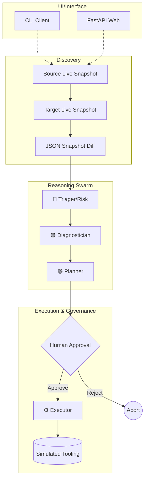
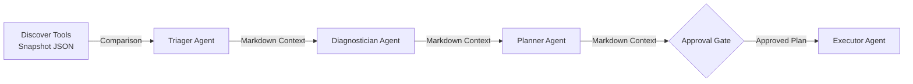

# 🚀 MigrationOps Copilot

**The AI-powered, multi-agent safeguard for website migrations.**

MigrationOps Copilot is an auditable, multi-agent reasoning engine that intercepts and validates website migrations before they cause production outages. By capturing deep infrastructure snapshots across source and target environments, the system leverages a specialized swarm of agents to detect, diagnose, and plan remediation for DNS anomalies, SSL regressions, and HTTP degradation.

Instead of relying on fragile spot-checks, MigrationOps Copilot forces migrations through a rigorous, human-in-the-loop governance timeline—where discovery is live, reasoning is autonomous, and execution is strictly gated. Built on the **Microsoft Agent Framework** and fueled by **Azure OpenAI**.

---

## ⚡ Quick Snapshot

| Category | Details |
| :--- | :--- |
| **Purpose** | Validate website migrations to prevent SSL, DNS, and HTTP breakage. |
| **Users** | SREs, DevOps Engineers, Cloud Migration Teams. |
| **Core Capability** | Multi-agent snapshot comparison and remediation simulation. |
| **Stack** | Python 3.10+, Microsoft Agent Framework, Azure OpenAI, FastAPI. |
| **Architecture Pattern**| Sequential deterministic pipeline with human-in-the-loop governance. |
| **Status** | Production-grade reasoning prototype; safe-simulated execution. |
| **Deployment Style** | Local CLI / Azure App Service / Local Docker / MCP-compatible. |
| **Notable Feature** | Strict separation of real discovery and simulated mutation logic. |

---

## 🛠 Features Highlights

- **Real-World Discovery:** Initiates actual TLS handshakes, performs strict DNS lookups, and reads true HTTP response matrices.
- **Deep Snapshot Comparison:** Creates zero-hallucination diffs between environments, computing a deterministic Migration Health Score.
- **Model Context Protocol (MCP):** Exposes health tools via an optional localized MCP server (`mcp_server`) to decouple discovery logic safely.
- **Immutable Human Approval:** CLI and asynchronous API endpoints physically block execution until explicit human authorization is granted.
- **Simulated Remediation:** Proves governance and tooling integration via safe abstractions (`cache_purge`, `cert_renewal`, `config_map`).

---

## 🧠 Why this exists

Website migrations are one of the easiest ways to ship a hidden outage. SSL certificates expire on the new load balancer, DNS targets change but propagate unevenly, or critical paths return 404s after cutover. Small teams traditionally validate these changes with manual *curl* checks or ad-hoc browser testing. The result: subtle breakage reaches users first. 

MigrationOps Copilot fixes this. It replaces fragile manual testing with a deterministic, AI-driven audit trail that validates exact state changes *before* traffic shifts fully.

---

## ⚙️ What it does

MigrationOps Copilot captures live state across two environments (Source and Target). It diffs the results and orchestrates a sequential pipeline of highly-specialized Azure OpenAI agents:
1. It flags exact regressions in SSL trust, DNS resolution, and HTTP health.
2. It assigns a risk category.
3. It performs root-cause diagnostics on the breakage.
4. It drafts a precise remediation plan.
5. It blocks on a human approval gate.
6. It formally "executes" the remediation plan against secure, simulated endpoints.

---

## 🗺️ Demo / User Journey

Imagine you are migrating `https://google.com` to `https://expired.badssl.com`. 
1. **Trigger:** You run `python main.py https://google.com https://expired.badssl.com`.
2. **Snapshot:** The system hits both URLs, noting `google.com` is healthy and `expired.badssl.com` has a fatal SSL expiration.
3. **Reasoning:** 
   - *Triager* flags the migration as `CRITICAL` risk with a health score of 15/100.
   - *Diagnostician* roots the cause in an expired X.509 certificate on the target.
   - *Planner* suggests running `simulate_cert_renewal()`.
4. **Approval:** The CLI pauses. `Approve this migration remediation plan? (y/n):`
5. **Execution:** You hit `y`. The Executor agent spins up, reads the plan, and safely triggers the simulated certificate renewal tool, returning a secure audit log.

---

## 📂 Repository at a glance

| Path | Purpose |
| :--- | :--- |
| `main.py` | CLI entrypoint orchestrating the multi-agent pipeline. |
| `app.py` | FastAPI application serving the Web UI and asynchronous API. |
| `pipeline.py` | The core state machine defining edge tools and agent sequence. |
| `agents/` | Handlers for Triager, Diagnostician, Planner, Executor, and Monitor agents. |
| `tools/baseline.py` | The real-world networking diff engine calculating Migration Health. |
| `tools/health_checks.py` | Live SSL, DNS, and HTTP inspection tools. |
| `tools/remediation.py` | Safe, simulated infrastructure modification tools. |
| `mcp_server/` | Optional Model Context Protocol server exposing baseline tools natively. |

---

## 🏛️ System Architecture

MigrationOps Copilot relies on edge-side discovery tools and localized MCP servers to fetch infrastructure truths. These truths are passed sequentially through a strict chain of intelligent agents, forcing a structural boundary before mutation.



**Subsystem Breakdown:**
- **Discovery (Real):** Uses native Python networking (HTTPX, Socket, SSL) to fetch ground truths.
- **Reasoning (Real):** Agents initialized with `AzureOpenAIResponsesClient` communicating over the Microsoft Agent Framework.
- **Execution (Simulated):** Agents emit tooling functions handled securely without altering root system state.

---

## 🏎️ How it works (Data Flow)

Data precisely cascades down the sequence. An agent only sees the prompt constraint, the tool outputs, and the raw text transmitted from the previous agent.



### Execution Lifecycle
1. **Startup:** `load_dotenv()` initializes the Azure OpenAI Identity connection.
2. **Request:** Client inputs source and target via `/api/analyze` or `main.py`.
3. **Processing:** The Pipeline triggers `baseline.py`. Output strings route strictly from `Triager -> Diagnostician -> Planner`.
4. **Output:** The end user is presented with the compiled diagnostics and remediation plan.

---

## 🧬 Core Technical Concepts

- **Sequential Pipeline vs Autonomous Loop:** By strictly moving from Discovery -> Triager -> Planner, the system limits the LLM's capability to hallucinate context or loop endlessly on simple tasks.
- **Data Grounding:** The foundation of all reasoning is a structured, deterministically compared JSON diff (`before_snapshot` vs `after_snapshot`). The LLM does not perform the inspection; it only interprets the hard data.
- **Security-First Mutability:** Destructive tooling (`tools/remediation.py`) explicitly mocks out its behavior. The orchestration logic is proven while keeping environments 100% safe.

---

## 🧩 Key Modules

### `pipeline.py`
- **Purpose:** Central nervous system of the repository.
- **Inputs:** `source_url`, `target_url`, `use_mcp`.
- **Outputs:** Consolidated JSON dict enclosing all agent outputs.
- **Dependencies:** `agents.*`, `tools.*`, `azure_client`.

### `agents/triager.py`
- **Purpose:** Initial risk classification.
- **Inputs:** Snapshot comparison string.
- **Outputs:** Risk level, blocking status string.

### `tools/baseline.py`
- **Purpose:** Pure network IO execution.
- **Outputs:** Deduplicated finding IDs and an aggregate Health Score.
- **Relationships:** Powers the entire "Real" part of the application before LLM abstraction.

---

## 💻 Developer Experience

### Quick Start
Ready to run out of the box with standard Python packaging.

**1. Prerequisites**
- Python 3.10+
- Azure CLI (`az login`) or `AZURE_OPENAI_API_KEY`

**2. Install**
```bash
git clone https://github.com/shahaman098/MigrationOps-Copilot.git
cd MigrationOps-Copilot
python3 -m venv .venv
source .venv/bin/activate
python -m pip install -r requirements.txt --pre
cp .env.example .env
```

**3. Local CLI Run**
```bash
python main.py https://google.com https://expired.badssl.com
```

**4. Web Server Run**
```bash
python app.py
# Open http://localhost:8000
```

**5. Testing Phase**
Tests are separated by required credentials.
```bash
# Non-Azure Network Tests
python -m pytest tests/test_tools.py tests/test_baseline.py -v

# Azure-dependent LLM Tests
python -m pytest tests/test_agents.py tests/test_pipeline.py -v
```

---

## ⚙️ Configuration

Set via `.env` at the root of the project.

| Variable | Required? | Usage |
| :--- | :--- | :--- |
| `AZURE_OPENAI_ENDPOINT` | **Yes** | Full URL to the Azure OpenAI resource point. |
| `AZURE_OPENAI_RESPONSES_DEPLOYMENT_NAME` | **Yes** | The exact name of your deployed inference model (e.g., `gpt-4o`). |
| `AZURE_OPENAI_API_KEY` | No | Overrides `AzureCliCredential` fallback mechanism. |

---

## 🔌 API / CLI / Interface Surface

### FastAPI Routes
| Route | Method | Payload Example | Action |
| :--- | :--- | :--- | :--- |
| `/api/analyze` | `POST` | `{"source_url": "x", "target_url": "y", "use_mcp": false}` | Generates diagnostic data. |
| `/api/execute` | `POST` | `{"analysis_id": "abc-123", "approved": true}` | Dispatches simulated execution. |

### CLI Interface
| Argument | Description |
| :--- | :--- |
| `<source_url>` | Required. Source origin URI. |
| `<target_url>` | Required. Target validation URI. |
| `--mcp` | Optional. Forces Discovery tools to proxy over the local `mcp_server`. |

---

## ⚖️ Architecture Decisions

**Observed:**
- **Human Governance Native:** The approval step is physically hard-coded into `main.py` and decoupled cleanly in `app.py` via asynchronous polling mechanisms. The system assumes autonomous mutation on infrastructure is fundamentally unsafe without a gate.
- **Model Context Protocol Validation:** By abstracting the network tools through an MCP Server, the repository proves that external logic networks can safely audit an environment even if the agent processing lives securely off-premises.

**Inferred:**
- **Ephemeral State Architecture:** In `app.py`, state is held loosely in a Python global dictionary (`analysis_store`). This removes database scaffolding dependencies for the Hackathon context, implying it's optimized for stateless rapid deployment (e.g., Azure App Service containers).

---

## 🚧 Current Limitations

- **Stateless API Memory:** As currently configured, restarting the `app.py` container clears the `analysis_store`, losing pending Execution states.
- **Deep DOM Spidering:** Health checks are restricted to SSL, DNS, and root index status. It does not recursive-spider applications for nested 404 links post-migration.
- **Simulated Executor Constraints:** The `simulate_cert_renewal()` tools intentionally stop short of actual system modifications. 

---

## 🚀 Roadmap & Likely Next Steps

- *(Inferred)* Implementation of a Redis or SQLite storage backend for `analysis_store` to support distributed horizontal scaling.
- *(Inferred)* Expanding toolkits to actual Azure/AWS API execution layers integrating proper IAC modifying libraries.
- Expanding the Discovery agent suite to parse multi-page HTTP paths and deeper latency distribution graphs.

---

## 🌟 Why this repo is technically interesting

MigrationOps Copilot demonstrates a masterclass in **Agentic Workflow Mapping**. Most initial LLM AI deployments errantly assign infinite tooling arrays to a single unbounded agent, resulting in context confusion, looping, and unpredictable infrastructure states. 

This repository enforces a **Supply Chain of AI Reasoning**. It fuses System 1 reasoning (deterministic, rapid Python network IO) perfectly with System 2 reasoning (deliberate, multi-stage Agent Swarms). It uses explicit sequential boundaries, effectively stopping hallucinations at the perimeter. It is a premium, structurally-sound exploration of modern SRE automation.

---

### Example Workflow 

A complete end-to-end execution of the safe "control" workflow.

```bash
$ python main.py https://google.com https://google.com

[DISCOVERY]
MIGRATION COMPARISON REPORT
Source: https://google.com
Target: https://google.com
...
Changes Detected: No changes detected.
Overall Risk: LOW
Migration Health Score: 100

[RISK ASSESSOR]
Risk Level: LOW 
All targets match successfully.

[DIAGNOSTICIAN]
No root causes found. Infrastructure states match.

[PLANNER]
Recommendation: Validate execution cleanly.

Approve this migration remediation plan? (y/n): y

[EXECUTOR]
No action required. Migration is validated.
```

---

## Contributing

Review the architecture paths and submit a Pull Request describing your agent or tooling addition in full detail. Ensure tests run successfully without Azure-access bindings.

---

Built to validate confidence. Engineered to eliminate hidden outages.
