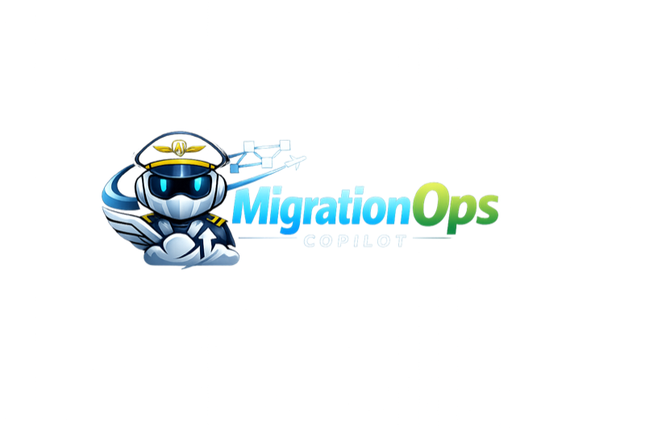
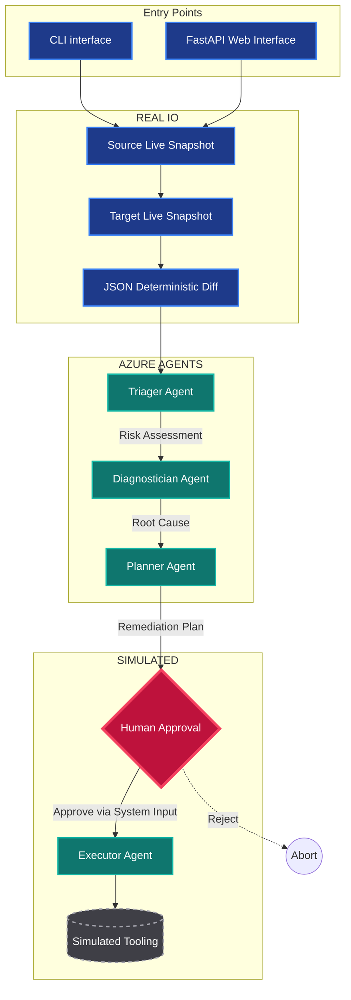
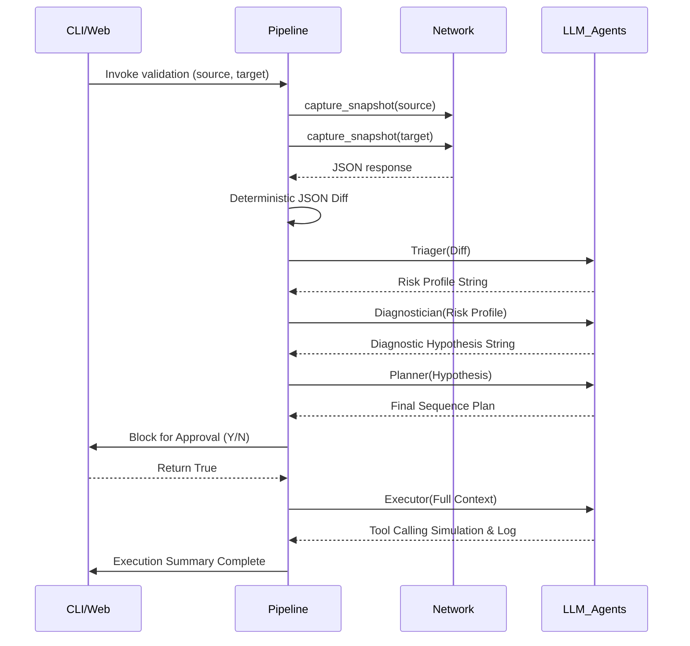

# MigrationOps Copilot 

<div align="center">
  
</div>
**An AI-assisted website migration validation layer that discovers, diagnoses, and remediates hidden infrastructure outages.**

MigrationOps Copilot is an end-to-end, deterministic validation application that acts as an intelligent safety net for cloud migrations. By comparing live infrastructure snapshots of Source and Target environments, the system identifies anomalies across SSL certificates, DNS resolution, and HTTP health. Using Microsoft Agent Framework, it channels these findings through a rigorous AI triage pipeline—assessing risks, explaining root causes, generating remediation plans, and enforcing a human-in-the-loop approval gate before simulating infrastructure fixes.

It's designed to replace fragile manual testing with a deterministic, LLM-reasoned audit trail, ensuring that broken migrations never see production traffic.

[](https://aka.ms/aidevdayshackathon)
[]()
[](https://github.com/shahaman098/MigrationOps-Copilot/actions/workflows/ci.yml)

> 🎥 **[Watch the 2-minute demo →](REPLACE_WITH_YOUTUBE_URL)**

<br/>

## Quick Snapshot

| Category | Details |
| :--- | :--- |
| **Purpose** | Validate website migrations to prevent SSL, DNS, and HTTP breakage. |
| **Users** | SREs, DevOps Engineers, Cloud Migration Teams. |
| **Core Capability** | Staged agent workflow over real snapshot comparison and simulated remediation. |
| **Stack** | Python 3.10+, Microsoft Agent Framework, Azure OpenAI, FastAPI, Web UI. |
| **Architecture Pattern**| Sequential deterministic pipeline with a human-in-the-loop governance gate. |
| **Status** | Verified prototype executing genuine live discovery and simulated remediation. |
| **Deployment Style** | Local CLI / Local Web UI / Azure App Service (preconfigured deployment) / Hosted MCP. |
| **Most interesting technical idea** | Strict isolation between deterministic network discovery, bounded LLM reasoning stages, and explicitly non-destructive simulated execution. |

## Why this exists

Website migrations routinely ship hidden outages. DNS cutovers propagate unevenly, SSL certificates are forgotten on new load balancers, and unmapped paths return silent 404s. Traditionally, engineering teams validate these transitions with ad-hoc `curl` scripts or manual browser testing. When small teams rely on manual validation, subtle regressions hit the end-user first.

MigrationOps Copilot solves this by formalizing post-migration verification. Instead of relying on a checklist, it creates a deterministic diff of environment states, forces an LLM to evaluate the concrete data for regressions, and drafts an actionable, reviewable plan before users ever interact with the new target.

## What it does

MigrationOps Copilot validates infrastructure natively:

- **State Capture**: Extracts live SSL trust, DNS resolution IPs, and HTTP status/latency from Source and Target endpoints.
- **Diffing Engine**: Computes a detailed JSON structural comparison to detect degradation.
- **Triaging**: Classifies the migration risk (Critical, High, Medium, Low) and sets a health score (0-100).
- **Diagnostics**: Explains the root cause of the findings (e.g., matching a 502 error to a mismatched App Gateway).
- **Remediation Planning**: Formulates step-by-step remediation procedures to fix the degradation.
- **Safety Gating**: Suspends application execution to require explicit human review via CLI or Web UI.
- **Execution Simulation**: Dispatches the approved plan to simulated infrastructure handlers and verifies the fix.

## Demo / user journey

**Journey: Migrating to a new Azure App Service**

1. A Cloud Engineer initiates validation via CLI: `python main.py https://prod-app.com https://staging-app.azurewebsites.net`.
2. The Copilot executes immediate network health tests and detects that the staging target lacks an updated SSL certificate and throws a 502 Bad Gateway.
3. The diff engine structures this failure into JSON and feeds it to the LLM agent pipeline.
4. The Triager immediately flags the migration as `🔴 CRITICAL`.
5. The Diagnostician attributes the failure to a missing SSL binding on the target App Service load balancer.
6. The Planner proposes generating an Azure Key Vault certificate renewal and updating the App Service config.
7. The CLI pauses: `Approve this migration remediation plan? (y/n):`
8. The engineer reads the output, hits `y`, and the Executor simulates the repair functions to log the success trail.

## Repository at a glance

| Path | Purpose |
| :--- | :--- |
| `app.py` | FastAPI application exposing the Web UI dashboard and JSON endpoints. |
| `main.py` | Command-line interface orchestration and CLI prompt handling. |
| `pipeline.py` | Central system orchestrator linking deterministic snapshots to the agent pipeline. |
| `agents/` | LLM reasoning modular files: `triager.py`, `diagnostician.py`, `planner.py`, `executor.py`. |
| `tools/` | Core logic integrating real network IO checks (`baseline.py`) and simulated execution. |
| `mcp_server/` | Model Context Protocol implementation for externalizing the application's health checks. |
| `docs/` | System architecture details, deployment recipes, and screenshot assets. |

## System architecture

MigrationOps Copilot deliberately sidesteps unbounded autonomous loops. Instead, it employs a unidirectional processing pipeline (a Directed Acyclic Graph). This guarantees a strict separation of concerns: **network telemetry -> deterministic parsing -> bounded reasoning -> simulated mutation**.



**Component Interaction and Control Flow**: 
1. Entry wrappers (`app.py` / `main.py`) hand off URLs to `pipeline.py`.
2. Python submodules (`ssl`, `socket`, `httpx`) generate real baseline diffs.
3. Microsoft Agent Framework instances ingest the text diff block one stage at a time.
4. Approval returns the control flow natively back to Python, allowing safe invocation of the Executor.

## How it works

1. **Instantiation**: The system connects the source and target endpoints.
2. **Snapshot Capture**: Live data across HTTP, SSL, and DNS is harvested perfectly concurrently.
3. **Diff Scoring**: The baseline tool computes a health score decrementing points for expired certs, 404s, or latencies.
4. **Triaging**: Azure OpenAI interprets the diff string and categorizes migration risk.
5. **Diagnostics**: Azure OpenAI writes a readable justification detailing why the network operations failed.
6. **Planning**: Azure OpenAI formats a remediation checklist.
7. **Simulation**: After human entry, the Executor calls `@tool` capabilities for cert renewal, config patching, and cache purging (which intentionally log themselves rather than write to cloud resources).

## Core technical concepts

- **State-isolated Snapshots**: LLMs are notoriously imprecise at running multi-step bash or network commands autonomously. MigrationOps solves this by doing the math exclusively in deterministically typed Python. The LLM acts solely as a sophisticated text summarization engine on top of hard JSON diff data.
- **Acyclic Reasoning**: The workflow prevents agent looping (hallucination spirals) by moving strictly sequentially through pre-defined reasoning personas.
- **Execution Sandboxing**: Reading from the infrastructure is real (`tools.health_checks`). Writing to the infrastructure is simulated (`tools.remediation`). Safety boundaries exist at the file-import level.

## Key modules

| Module | Purpose | Inputs | Outputs | Dependencies | Relationship |
| :--- | :--- | :--- | :--- | :--- | :--- |
| `pipeline.py` | Central orchestration engine. | String URLs, boolean MCP toggles. | Formatted string payload of all pipeline outputs. | `agents/`, `tools/` | Invokes everything below it sequentially. |
| `tools/baseline.py` | Pure deterministic snapshot diffing. | URL strings. | JSON-serialized health diff representation. | `health_checks.py` | Powers the literal intelligence of the tool without using AI. |
| `agents/triager.py` | Determines application risk. | JSON baseline diff text. | Actionable risk tiering. | Agent Framework | Starts the reasoning cascade. |
| `mcp_server/server.py`| Model Context Protocol exposure. | JSON-RPC calls. | Discoverability configurations. | `mcp`, `health_checks` | Exposes local health tools as hosted server proxies. |

## Data flow



## Execution lifecycle

**1. Startup:** The user boots `app.py` or `main.py` loading the `.env` Azure credentials.
**2. Request:** Two URLs are supplied.
**3. Processing:** 
   - A sequential IO block fires capturing both environments entirely into memory. 
   - Python code performs strict baseline dict comparisons, spitting out a formatted data structure.
   - Three independent LLM executions trigger consecutively (Triager -> Diagnostician -> Planner). Each execution strictly parses the text block output of its predecessor.
   - The CLI blocks inside an `input()` trap. `app.py` abandons the HTTP request, storing the context dictionary in RAM waiting for a `/api/execute` endpoint hit.
**4. Output:** Upon approval, the final Executor resolves the issue via simulated function calls and delivers the final runbook trace to the user.

## Developer experience

MigrationOps Copilot is heavily optimized for zero-pain testing using simple Python standard libraries.

- **Prerequisites**: Python 3.10+, and an Azure Subscription (either an Azure CLI `az login` instance acting natively, or standard `AZURE_OPENAI_API_KEY` injections).
- **Setup**: Clone, standard `venv` creation, and `pip install -r requirements.txt`.
- **Test**: Includes native `pytest` hooks that assert baseline network accuracy.
- **Build/Debug**: Handled cleanly as the application logic exists purely as raw Python—no compilation required. Fast reloads via `uvicorn`.

## Configuration

Standard environment file mapping via `.env`.

| Environment Variable | Required for | Function |
| :--- | :--- | :--- |
| `AZURE_OPENAI_ENDPOINT` | Direct Mode | Full URL to the Azure OpenAI endpoint resource. |
| `AZURE_OPENAI_RESPONSES_DEPLOYMENT_NAME` | Direct Mode | The name of the underlying model deployment. |
| `AZURE_OPENAI_API_KEY` | Optional | API Key. Without this, standard Azure DefaultAzureCredential takes over. |
| `AZURE_AI_PROJECT_ENDPOINT` | Foundry Mode | Foundry-compatible Azure AI endpoint URL for alternative inference processing. |
| `AZURE_AI_MODEL_DEPLOYMENT_NAME` | Foundry Mode | Model deployment name configured on the Foundry backend. |
| `MCP_SERVER_URL` | Optional | Redirects discovery capability logic over a public or local Model Context Protocol endpoint structure. |

## API / CLI / Interface surface

### CLI Capabilities
```bash
python main.py <source_url> <target_url> [--mcp]
```
| Command | Result |
| :--- | :--- |
| Positional URL 1 | Source of truth application URI. |
| Positional URL 2 | Target verification application URI. |
| `--mcp` | Forces the discovery snapshot to transmit routing via the `mcp_server`. |

### Application Routes (`app.py`)
| Endpoint | Method | Payload | Description |
| :--- | :--- | :--- | :--- |
| `/` | `GET` | N/A | Returns the static Next/Vue-style HTML payload dashboard interface. |
| `/api/analyze` | `POST` | `{"source_url": "v", "target_url": "v", "use_mcp": False}` | Dispatches asynchronous validation and terminates prior to approval state. |
| `/api/execute` | `POST` | `{"analysis_id": "abc-123", "approved": true}` | Accepts human verification and commands the Executor agent. |

## Architecture decisions

**Observed Design Choices**
- **Explicit Sandbox Isolation**: Real diagnostic read-operations are physically separated into `baseline.py` from the mock infrastructure write-operations in `remediation.py`. 
- **In-Memory Web Orchestration**: To favor hackathon velocity, `app.py` holds execution states loosely inside an `analysis_store` dictionary rather than standing up an SQLite or PostgreSQL instance.

**Inferred Design Choices**
- **Strict DAG over Swarm Logic**: While autonomous agent loops are popular, website infrastructure is unforgiving. Relying on a rigid Directed Acyclic Graph prevents the execution engine from making redundant or hallucinatory API calls.
- **Model Context Protocol as an Extensibility Pattern**: Implementing MCP ensures that future remote agent clusters can utilize these specific migration verification tools instantly without SDK rewrites.

## Current limitations

- **Loss of State on Reboot**: The FastAPI Web UI relies on dictionary memory for holding `/api/analyze` payloads. Terminating `uvicorn` destroys pending approval runs.
- **Surface-Level Spidering**: The application checks root latency, host DNS, and primary SSL negotiation. It does not recursively traverse the target application (Deep DOM spidering) looking for missing static asset links (e.g., misconfigured CDN base paths yielding 404 image tags).
- **Execution Limits**: The execution phase strictly verifies its logging capability rather than actually invoking `az network application-gateway ssl-cert update`. 

## Roadmap / likely next steps

- *(Inferred)* Implementation of a resilient cache layer (Redis or Memcached) storing the migration context UUID states for fault-tolerant horizontal scaling across App Service fleets.
- *(Inferred)* Development of direct Azure Resource Graph execution plugins replacing the simulated executor functions with actual Azure SDK mutating calls.
- Addition of Selenium/Playwright tools into the discovery baseline for accurate deep-link DOM validation against Single Page Applications.

## Why this repo is technically interesting

MigrationOps Copilot highlights exactly how LLMs should be used in enterprise incident response: interpreting complexity, drafting plans, and organizing data, rather than performing unchecked command-execution. By combining perfectly deterministic python networking with the semantic power of the Microsoft Agent Framework, it offers a verifiable way to govern complex architecture changes. Furthermore, the repository is adaptable instantly to both direct Azure OpenAI and modern Model Context Protocol schemas without impacting the user workflow layer.

## Getting started

**Launch the Copilot Web UI with simulated runs locally:**

```bash
git clone https://github.com/shahaman098/MigrationOps-Copilot.git
cd MigrationOps-Copilot

# Create isolation
python3 -m venv .venv
source .venv/bin/activate
pip install -r requirements.txt --pre

# Prepare the environment context
cp .env.example .env
# [Edit .env with your AZURE_OPENAI_ENDPOINT and DEPLOYMENT settings]

# Boot local server
python app.py
```
Open `http://localhost:8000` to interact.

## Example workflow

Verify how an outdated target behaves in front of the Copilot CLI. (Using `expired.badssl.com` as an intentional target failure).

```bash
python main.py https://example.com https://expired.badssl.com
```

*Output trace snippet:*
```text
[DISCOVERY] Migration comparison complete
[DISCOVERY] Summary: 2 changes, risk=CRITICAL, health_score=15

[RISK ASSESSOR]
RISK LEVEL: 🔴 CRITICAL
The target environment has triggered an execution breakdown regarding its SSL configuration and HTTP 404 response structure.

[PLANNER]
1. Revoke existing cached configuration templates for the target Application Gateway.
2. Initialize an Azure Key Vault routine to fetch an updated valid certificate matching `example.com`.
...
Approve this migration remediation plan? (y/n): 
```

## Contributing

Professional standard rules apply. Contributions, issues, and feature requests are welcome. When iterating, please ensure the rigid separation of Read (Deterministic Network IO) and Write (Simulated Operations) is upheld.

## Final note

MigrationOps is proof that automated infrastructure validation doesn't need to be brittle bash scripts. Through structured intelligence, confidence in delivery can become standard procedure.

---

*Engineered to eliminate hidden migration outages.*
