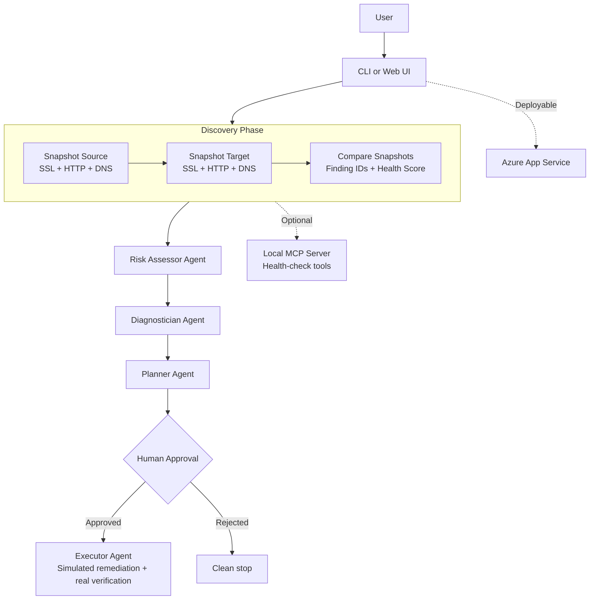

# 🚀 MigrationOps Copilot
[](https://github.com/shahaman098/MigrationOps-Copilot/actions/workflows/ci.yml)

**AI-powered multi-agent website migration validation built with Microsoft Agent Framework**

Built for the [Microsoft AI Dev Days Global Hackathon](https://aka.ms/aidevdayshackathon)

## Problem Statement

Website migrations are one of the easiest ways to ship a hidden outage. SSL certificates expire, DNS targets change, pages return the wrong status code, and response times degrade after cutover. Small teams usually validate migrations with a few manual spot checks, miss subtle breakage, and only learn about failures from users. MigrationOps Copilot turns that manual process into an auditable AI workflow that checks what changed before the migration goes fully live.

## What It Does

MigrationOps Copilot takes a source URL and a target URL, snapshots both with real SSL, HTTP, and DNS checks, compares the results, then passes the comparison through specialized AI agents for risk assessment, diagnosis, remediation planning, and simulated execution with a human approval gate before any action is taken.

## Architecture Diagram



## Agent Details

| Agent | Role | Input | Output | Tools |
|-------|------|-------|--------|-------|
| Discovery | Capture source and target state | Source URL, Target URL | Two live snapshots and a migration comparison report | `check_ssl_certificate`, `check_http_status`, `check_dns_resolution` |
| Risk Assessor | Classify migration risk | Comparison report | Risk level, blocking issues, recommendation | None |
| Diagnostician | Explain root causes | Risk assessment | Root cause analysis per issue | None |
| Planner | Build remediation plan | Diagnostics report | Prioritized remediation plan | None |
| Executor | Simulate approved fixes | Approved plan and migration context | Execution log and final verification status | `simulate_cert_renewal`, `simulate_cache_purge`, `simulate_config_update`, `check_http_status` |

## Microsoft Technologies Used

| Technology | How It's Used |
|-----------|--------------|
| **Microsoft Agent Framework** | All reasoning agents are built with Agent Framework RC4 using `AzureOpenAIResponsesClient` and `@tool`-decorated tools |
| **Azure OpenAI (via Foundry)** | LLM backend for risk assessment, diagnosis, planning, execution, and optional MCP-backed discovery |
| **Azure MCP** | Local MCP server exposes health-check tools over the Model Context Protocol for optional discovery routing |
| **Azure App Service** | Documented deployment target for the FastAPI web UI |
| **GitHub Actions** | CI runs syntax checks and non-Azure tests on every push and pull request |

### 🔬 Real vs. Simulated

| Component | Status |
|-----------|--------|
| SSL certificate check | ✅ **REAL** — actual TLS handshake |
| HTTP status check | ✅ **REAL** — actual HTTP request |
| DNS resolution check | ✅ **REAL** — actual DNS lookup |
| Snapshot comparison | ✅ **REAL** — deduplicated diff with finding IDs and health score |
| Agent reasoning | ✅ **REAL** — Azure OpenAI model calls |
| Human approval gate | ✅ **REAL** — CLI prompt and web approval step |
| Certificate renewal | ⚠️ **SIMULATED** — logged only |
| Cache purge | ⚠️ **SIMULATED** — logged only |
| Config update | ⚠️ **SIMULATED** — logged only |

> Remediation stays simulated on purpose. The hackathon prototype proves the agent workflow and governance boundary without mutating real infrastructure.

## 🚀 Quick Start

**Prerequisites**

- Python 3.10+
- Azure OpenAI Responses deployment
- Azure CLI login or `AZURE_OPENAI_API_KEY`

**Setup**

```bash
git clone https://github.com/shahaman098/MigrationOps-Copilot.git
cd MigrationOps-Copilot
python3 -m venv .venv
source .venv/bin/activate
python -m pip install -r requirements.txt --pre
cp .env.example .env
# Edit .env with your Azure OpenAI settings
```

**CLI**

```bash
python main.py https://source-site.com https://target-site.com
```

**Broken migration example**

```bash
python main.py https://google.com https://expired.badssl.com
```

**Clean migration example**

```bash
python main.py https://google.com https://google.com
```

### 🌐 Web UI

```bash
python app.py
# Open http://localhost:8000
```

The web interface runs the same pipeline as the CLI and exposes the same approval gate before simulated remediation.

### 🔗 MCP Server

MigrationOps Copilot includes an MCP server that exposes the health-check tools over Model Context Protocol:

```bash
python -m mcp_server.server
python main.py https://google.com https://expired.badssl.com --mcp
```

The default path still uses direct Python tool calls for maximum reliability.

### ☁️ Azure Deployment

Deploy the web UI to Azure App Service:

```bash
az webapp up --name migrationops-copilot-demo --resource-group migrationops-rg --runtime "PYTHON:3.12"
```

See [docs/azure-deploy.md](docs/azure-deploy.md) for the full deployment flow.

### ✅ Verified Scenarios

| Source | Target | Expected Risk | Health Score | Result |
|--------|--------|---------------|-------------|--------|
| `https://google.com` | `https://expired.badssl.com` | `CRITICAL` | ~15/100 | Agents recommend blocking the migration |
| `https://google.com` | `https://google.com` | `LOW` | ~100/100 | Agents recommend proceeding |

## Tests

```bash
python -m pytest tests/test_tools.py tests/test_baseline.py -v
python -m pytest tests/test_agents.py -v
python -m pytest tests/test_pipeline.py -v
```

`tests/test_tools.py` and `tests/test_baseline.py` run without Azure credentials.  
`tests/test_agents.py` and `tests/test_pipeline.py` require Azure OpenAI access.

## Demo

The repo is ready for the final 2-minute recording. Add the public demo URL here before submission.

Suggested demo path:

- Show the architecture diagram
- Run `google.com -> expired.badssl.com`
- Highlight the critical findings and low health score
- Approve the plan and show simulated execution
- Run `google.com -> google.com` as the clean control case

## Project Structure

```text
MigrationOps-Copilot/
├── app.py
├── main.py
├── pipeline.py
├── azure_client.py
├── agents/
│   ├── monitor.py
│   ├── triager.py
│   ├── diagnostician.py
│   ├── planner.py
│   └── executor.py
├── tools/
│   ├── health_checks.py
│   ├── remediation.py
│   └── baseline.py
├── tests/
│   ├── test_tools.py
│   ├── test_monitor.py
│   ├── test_baseline.py
│   ├── test_agents.py
│   └── test_pipeline.py
├── mcp_server/
│   ├── server.py
│   └── README.md
├── static/
│   └── index.html
├── docs/
│   ├── architecture.md
│   └── azure-deploy.md
├── .github/workflows/
│   └── ci.yml
├── Procfile
├── startup.sh
├── DEMO_SCRIPT.md
├── requirements.txt
├── .env.example
└── LICENSE
```

## Hackathon Category

**Primary target:** Best Multi-Agent System

MigrationOps Copilot is strongest as a specialized multi-agent workflow: discovery, risk assessment, diagnosis, planning, and governed execution work together to validate whether a migration is safe to launch.

## Why This Matters

Migration validation is usually rushed, manual, and easy to get wrong. MigrationOps Copilot turns it into a structured workflow with grounded checks, specialized AI reasoning, and a clear human approval boundary. It is an AI migration validation team for lean engineering organizations that still need disciplined go-live decisions.
