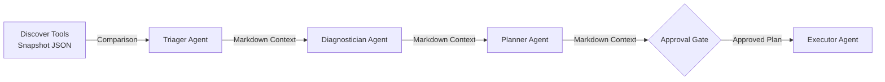

# MigrationOps Copilot: Architecture & Technical Deep Dive

This document expands on the implementation and structural design of MigrationOps Copilot.

The repo supports two Azure-backed reasoning modes:

- direct Azure OpenAI via `AZURE_OPENAI_ENDPOINT`
- optional Azure AI project endpoint / Foundry-compatible mode via `AZURE_AI_PROJECT_ENDPOINT`

The MCP path is optional:

- default local MCP client mode for local testing
- hosted MCP tool mode when `AZURE_AI_PROJECT_ENDPOINT` and a public HTTPS `MCP_SERVER_URL` are configured

## System Architecture: Data Flow

Data precisely cascades down the sequence. An agent only sees the prompt constraint, the tool outputs, and the raw text transmitted from the previous agent.

## Core Technical Concepts

- **Sequential Pipeline vs Autonomous Loop:** By strictly moving from Discovery -> Triager -> Planner, the system limits the LLM's capability to hallucinate context or loop endlessly on simple tasks.
- **Data Grounding:** The foundation of all reasoning is a structured, deterministically compared JSON diff (`before_snapshot` vs `after_snapshot`). The LLM does not perform the inspection; it only interprets the hard data.
- **Security-First Mutability:** Destructive tooling (`tools/remediation.py`) is simulated. The orchestration logic is proven while keeping environments safe.

## Key Modules

### `pipeline.py`
- **Purpose:** Central nervous system of the repository.
- **Inputs:** `source_url`, `target_url`, `use_mcp`.
- **Outputs:** Consolidated JSON dict enclosing all agent outputs.
- **Dependencies:** `agents.*`, `tools.*`, `azure_client`.

### `agents/triager.py`
- **Purpose:** Initial risk classification.
- **Inputs:** Snapshot comparison string.
- **Outputs:** Risk level, blocking status string.

### `tools/baseline.py`
- **Purpose:** Pure network IO execution.
- **Outputs:** Deduplicated finding IDs and an aggregate Health Score.
- **Relationships:** Powers the entire "Real" part of the application before LLM abstraction.

## Architecture Decisions

**Observed:**
- **Human Governance Native:** The approval step is physically hard-coded into `main.py` and split cleanly in `app.py` across separate `/api/analyze` and `/api/execute` calls. The system assumes autonomous mutation on infrastructure is fundamentally unsafe without a gate.
- **Model Context Protocol Validation:** The discovery tools can run either through a local MCP client path or a hosted MCP tool path when the Azure-backed client is configured with a public MCP server URL.

**Inferred:**
- **Ephemeral State Architecture:** In `app.py`, state is held loosely in a Python global dictionary (`analysis_store`). This removes database scaffolding dependencies for the Hackathon context, implying it's optimized for stateless rapid deployment (e.g., Azure App Service containers).

## Current Limitations

- **Stateless API Memory:** As currently configured, restarting the `app.py` container clears the `analysis_store`, losing pending Execution states.
- **Deep DOM Spidering:** Health checks are restricted to SSL, DNS, and root index status. It does not recursive-spider applications for nested 404 links post-migration.
- **Simulated Executor Constraints:** The `simulate_cert_renewal()` tools intentionally stop short of actual system modifications. 

## Roadmap & Likely Next Steps

- *(Inferred)* Implementation of a Redis or SQLite storage backend for `analysis_store` to support distributed horizontal scaling.
- *(Inferred)* Expanding toolkits to actual Azure/AWS API execution layers integrating proper IAC modifying libraries.
- Expanding the Discovery agent suite to parse multi-page HTTP paths and deeper latency distribution graphs.

## Why this repo is technically interesting

MigrationOps Copilot keeps the real-vs-simulated boundary explicit. Discovery, comparison, and verification are grounded in live network checks, while remediation stays simulated. The repo also supports both a direct Azure OpenAI path and a project-endpoint / hosted-MCP path without changing the user-facing CLI or web API.
